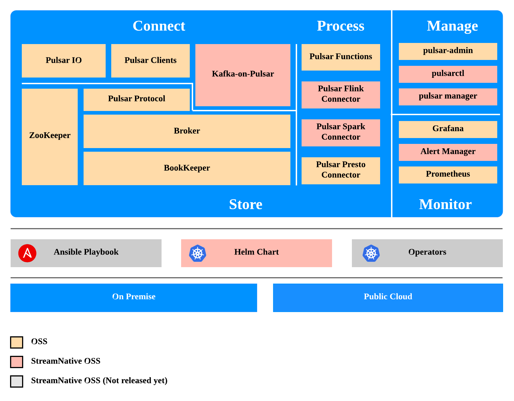

<!--

#
# Copyright (c) 2020 StreamNative, Inc.. All Rights Reserved.
#

-->


## StreamNative Platform

[StreamNative Platform](https://streamnative.io/platform/) is a cloud-native event streaming platform powered by Apache Pulsar, providing the capability for connecting, storing and processing event streams for enterprises.



### Tarball Introduction


**sn-platform-all**:

- pulsar-core
- control-center
- connectors
- offload

**pulsar-core**:

- Broker
- BookKeeper
- Zookeeper
- Proxy
- WebSocket
- Pulsarctl

**control-center**:

- Pulsar Manager
- Prometheus
- Grafana
- Alert Manager
- Node Exporter

## Available Releases

| Version | Reference |
| --------| --------- |
| [v1.0.0](https://github.com/streamnative/sn-platform/releases/tag/v0.1.0)| [https://streamnative.io/docs/1.0.0/overview/](https://streamnative.io/docs/1.0.0/overview/)

## License

```text
#
# Copyright (c) 2020 StreamNative, Inc.. All Rights Reserved.
#
```

